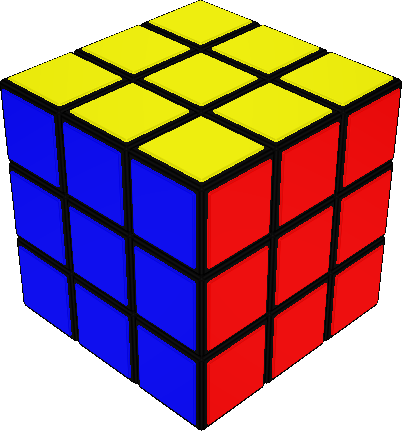
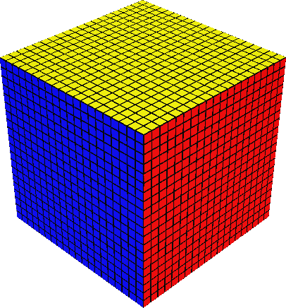

<h1 align="center">Rubiks Cube</h1>
<p align="center">Rubiks cube of any size in browser.</p>
<p align="center">
    <span>&nbsp;&nbsp;&nbsp;&nbsp;&nbsp;&nbsp;&nbsp;&nbsp;&nbsp;&nbsp;&nbsp;&nbsp;</span>
    <span>&nbsp;&nbsp;&nbsp;&nbsp;&nbsp;&nbsp;&nbsp;&nbsp;&nbsp;&nbsp;&nbsp;&nbsp;</span>
</p>

## Introduction

Rubiks cube made in <a href='https://threejs.org/'>three.js</a>

## How to install

    git clone https://github.com/allala0/rubiks-cube.js.git
    npm install

## How to build
    npm run build

## How to run examples

    npm run example

OR

    npm run example-module

## How to use
    import RubiksCube from './build/RubiksCube.module.js';

    const size = 3;
    const cube = new RubiksCube(size);
    scene.add(cube);

OR FOR INTERACTIVE CUBE

    import RubiksCube from './build/RubiksCube.module.js';

    const size = 3;
    const cube = new RubiksCube(sizes, camera, renderer.domElement);
    scene.add(cube);

OR FOR INTERACTIVE CUBE WHEN YOU USE ORBIT CONTROLS

    import RubiksCube from './build/RubiksCube.module.js';

    const size = 3;
    const cube = new RubiksCube(sizes, camera, renderer.domElement, controls);
    scene.add(cube);

## TODO

- [x] **3d rubiks cube of any size**
- [x] **Cube user control system**
- [x] **Scramble function**
- [x] **Unscramble function**
- [x] **Optimalisation: don't create cubies that are not visable (inside cube)**q
- [x] **Bug fixes - connect tiles with cubie faces in term of mouse click detection**
- [x] **Rounded edges of cubie stickers and cubies**
- [ ] **Code cleanup and rewrite**
- [ ] **Cube rotations function**
- [ ] **AI solver**
- [ ] **Functions to make patterns on cube for example: checkers, cube in cube**
- [ ] **Moves containing many layers at the same time in scramble**
- [ ] **Reverse one move function**
- [ ] **Support for phone user controls**
- [ ] **Timer**
- [ ] **Solve stats (time, number of moves, replay)**
- [ ] **Mirror cube**
- [ ] **Pyraminx**
- [ ] **Skweb**
- [ ] **Megaminx**
- [ ] **Square-1**
- [ ] **3x3x2, 3x3x1, 2x2x1**
- [ ] **3x3x1**
- [ ] **2x2x1**

## License

```
MIT License

Copyright (c) 2022 Artur Brytkowski

Permission is hereby granted, free of charge, to any person obtaining a copy
of this software and associated documentation files (the "Software"), to deal
in the Software without restriction, including without limitation the rights
to use, copy, modify, merge, publish, distribute, sublicense, and/or sell
copies of the Software, and to permit persons to whom the Software is
furnished to do so, subject to the following conditions:

The above copyright notice and this permission notice shall be included in all
copies or substantial portions of the Software.

THE SOFTWARE IS PROVIDED "AS IS", WITHOUT WARRANTY OF ANY KIND, EXPRESS OR
IMPLIED, INCLUDING BUT NOT LIMITED TO THE WARRANTIES OF MERCHANTABILITY,
FITNESS FOR A PARTICULAR PURPOSE AND NONINFRINGEMENT. IN NO EVENT SHALL THE
AUTHORS OR COPYRIGHT HOLDERS BE LIABLE FOR ANY CLAIM, DAMAGES OR OTHER
LIABILITY, WHETHER IN AN ACTION OF CONTRACT, TORT OR OTHERWISE, ARISING FROM,
OUT OF OR IN CONNECTION WITH THE SOFTWARE OR THE USE OR OTHER DEALINGS IN THE
SOFTWARE.
```